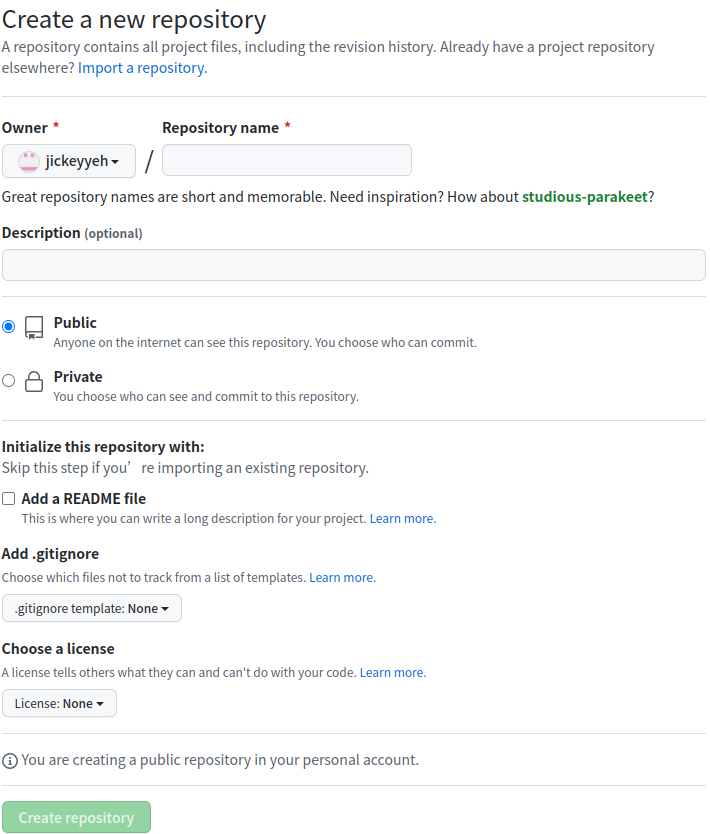
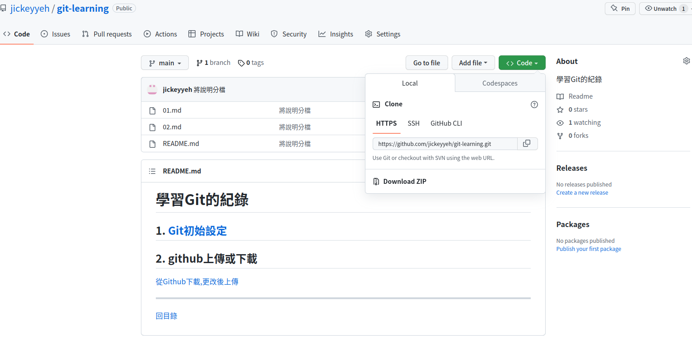

# 從Github創立新專案下載,更改後上傳

## Create a new repository

連接github後, 創建新專案

如下圖


1. 輸入Repository name
2. Description 為專案描述
3. 選擇Public 公開, 或者Private私人
4. 如果此專案在Github新建的, local端並沒有

Initialize this repository with:
Skip this step if you’re importing an existing repository.

上面這段有告訴你說, 請忽略以下步驟
但因為我們是新建立的, 所以需要

Add a README file

```
增加一個專案說明文件
```

Add .gitignore

```
可以將一些關鍵隱私, 或者敏感檔案, 設定為不追蹤
離如IP, 伺服器資訊, 帳號密碼等等
```

Choose a license

```
用來宣告讓其他人知道, 可以用你的代碼, 做什麼跟不能做什麼
```

## 下載剛剛創建的專案



進入剛剛創立的專案, 點選<\>code的部份
會看到local下, clone的方式

可以透過HTTPS, 也可以透過SSH

因為我當初有設定好SSH key, 因此選擇使用SSH的方式clone下來

輸入下列指令

```bash
git clone git@github.com:jickeyyeh/git-learning.git
```

成功的話結果應該像這樣

```bash
Cloning into 'git-learning'...
remote: Enumerating objects: 6, done.
remote: Counting objects: 100% (6/6), done.
remote: Compressing objects: 100% (3/3), done.
remote: Total 6 (delta 0), reused 0 (delta 0), pack-reused 0
Receiving objects: 100% (6/6), done.

```
你就會看到在你下指令當前的目錄下, 多了一個git-learning的目錄

內容大約如下

```bash
jickey@jickey:~/git/git-learning$ ls
README.md
jickey@jickey:~/git/git-learning$ ls -a
.  ..  .git  README.md
jickey@jickey:~/git/git-learning$ cd .git/
jickey@jickey:~/git/git-learning/.git$ ls
branches  config  description  HEAD  hooks  index  info  logs  objects  packed-refs  refs
jickey@jickey:~/git/git-learning/.git$ cat config 
[core]
	repositoryformatversion = 0
	filemode = true
	bare = false
	logallrefupdates = true
[remote "origin"]
	url = git@github.com:jickeyyeh/git-learning.git
	fetch = +refs/heads/*:refs/remotes/origin/*
[branch "main"]
	remote = origin
	merge = refs/heads/main

```

可以看到裡面擁有一個.git目錄, 和一個README.md 初始說明文件
.git目錄在網路上搜尋有非常多的說明, 基本上專案的一些設定都可以在這個目錄完成


## 更改後上傳

因為是直接clone自己新創立的專案下來編輯, 所以上傳方式就很簡單了


### 1. 新增新檔, 或修改專案資料夾內的檔案內容

我新增了一個新檔, 輸入git status後狀態就會如下

```bash
jickey@jickey:~/git/git-learning$ git status 
On branch main
Your branch is up to date with 'origin/main'.

Changes not staged for commit:
  (use "git add <file>..." to update what will be committed)
  (use "git checkout -- <file>..." to discard changes in working directory)

	modified:   README.md

Untracked files:
  (use "git add <file>..." to include in what will be committed)

	01.md

no changes added to commit (use "git add" and/or "git commit -a")
```

### 2. 將專案資料夾下異動過的檔案或資料夾, 加入staged

這時再輸入git add . 將目錄下所有檔案加入staged後, 狀態會如下

```bash
jickey@jickey:~/git/git-learning$ git add .
jickey@jickey:~/git/git-learning$ git status 
On branch main
Your branch is up to date with 'origin/main'.

Changes to be committed:
  (use "git reset HEAD <file>..." to unstage)

	new file:   01.md
	modified:   README.md
```

>其實也可以直接輸入git commit -a -m "說明這次更動"
>等同於git add. + git commit -m "說明這次更動"

### 3. commit 

輸入git commit -m "說明"後, 狀態會如下

```bash
jickey@jickey:~/git/git-learning$ git commit -m "測試"
[main 493b731] 測試
 2 files changed, 8 insertions(+), 1 deletion(-)
 create mode 100644 01.md
jickey@jickey:~/git/git-learning$ git status 
On branch main
Your branch is ahead of 'origin/main' by 1 commit.
  (use "git push" to publish your local commits)

nothing to commit, working tree clean
```

### 4. 上傳修改後的內容, 到github上

commit完以後, 只要輸入git push就可以把更改後的東西上傳上去了

```bash
jickey@jickey:~/git/git-learning$ git push
Counting objects: 4, done.
Delta compression using up to 4 threads.
Compressing objects: 100% (3/3), done.
Writing objects: 100% (4/4), 435 bytes | 435.00 KiB/s, done.
Total 4 (delta 1), reused 0 (delta 0)
remote: Resolving deltas: 100% (1/1), completed with 1 local object.
To github.com:jickeyyeh/git-learning.git
   887860b..493b731  main -> main
```


---
[回目錄](README.md)

