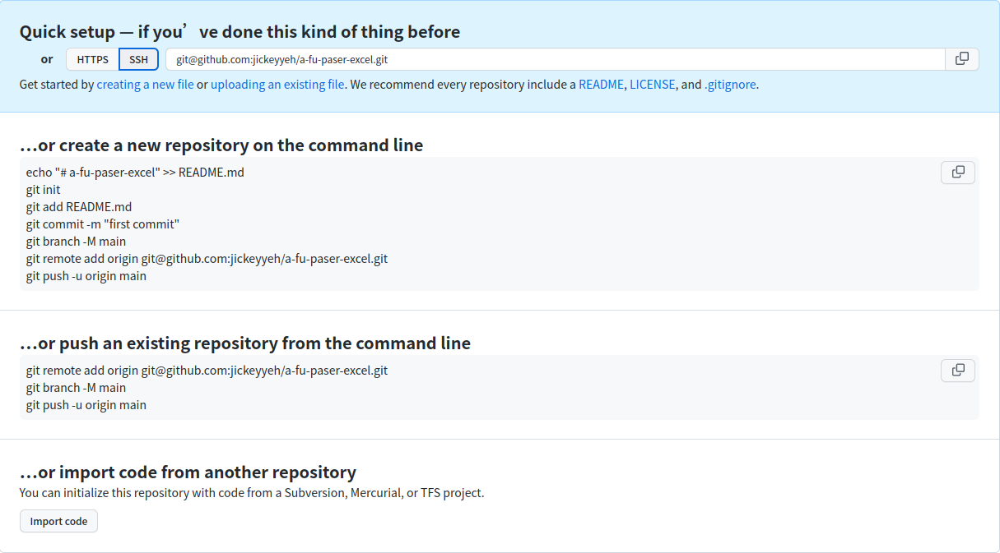

# 從本機創立專案, 上傳git

## 1. 初始化目錄

(1). 在local端, 新增專案

(2). 新增README.md, 紀錄專案資料

也可以執行下列指令

```shell
echo "# 目錄名稱" >> README.md
```

(3). 輸入git init

結果大概會如下

```shell
jickey@jickey:~/git/a-fu-paser-excel$ ls
parse_excel_20220222.py
jickey@jickey:~/git/a-fu-paser-excel$ git init
Initialized empty Git repository in /home/jickey/git/a-fu-paser-excel/.git/
jickey@jickey:~/git/a-fu-paser-excel$ git status 
On branch master

No commits yet

Untracked files:
  (use "git add <file>..." to include in what will be committed)

	parse_excel_20220222.py

nothing added to commit but untracked files present (use "git add" to track)
``` 

## 2. Commit

(1). 輸入git add . 然後git commit -m "說明這次更動"

(2). 也可以直接輸入git commit -a -m "說明這次更動"


## 3. 在Github上, 創建一個同名專案

(1). 到帳戶首頁, 選擇Repositories, 點選New

(2). 不選擇Add a README file, 因此專案不會執行初始化 

(3). 按下創建以後, 會看到提示如下圖(選擇SSH)



可以看到Git很貼心的教學, 接下來該怎麼做

**…or create a new repository on the command line**

>這個是指, 你在Github創立一個空的專案, 也沒初始化
>
>然後想在local端開始建立專案, 該怎麼做

**…or push an existing repository from the command line**

>這個是指, 你在Github創立一個空的專案, 也沒初始化
>
>然後local端, 本來就有一個專案目錄, 這時該怎麼做

**…or import code from another repository**

>這個是指, 從別的儲存庫, 載入你的程式


## 4. 將local端的專案, 預設上傳, 設定為新創立的Github repository

(1). 設定遠端地址

指令如下:

```shell
git remote add origin git@github.com:jickeyyeh/a-fu-paser-excel.git
```

origin後面的URL, 是取決於你選擇預設上傳方式不同, 呈現的不同
如果選擇HTTPS, 就會像下列這樣

>https://github.com/jickeyyeh/a-fu-paser-excel.git

(2). 設定為主分支

指令如下

```shell
git branch -M main
```

(3). 將local端的專案, 上傳到Github

指令如下

```
git push -u origin main
```

---
[回目錄](README.md)

