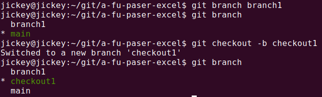
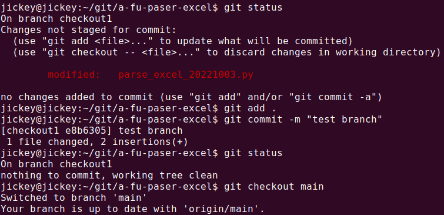
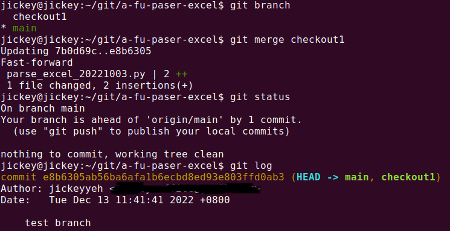

# 建立額外的分支, 以及合併

## 1. 建立分支方法

建立分支有兩種方式

(1). 直接建立分支

```
git branch {要創建的名稱}
```

(2). 同時建立分支, 並切換到該分支

```
git checkout -b {要創建的名稱}
```

執行結果大概如下圖所示



## 2. 切換分支

```
git branch {要切換的分支名稱}
```

>輸入git branch可查詢目前在哪一個分支

## 3. 合併分支

當你在分支修改或者除錯完畢, 要將結果合併回主要分支時


(1). 儲存提交後, 切回主要分支 (重要)

```
git add .   #將修改結果儲存
git commit -m "當下註明"   #提交修改結果
git checkout main   #main為主要分支名稱, 並無固定, 看使用者取的
```
執行結果如下圖



(2). 將修改合併回主要分支

```
git branch   #先確認是否在主分支
git merge {要合併的分支名稱}  #確認後合併分支
```

執行結果如下圖




---
[回目錄](README.md)

