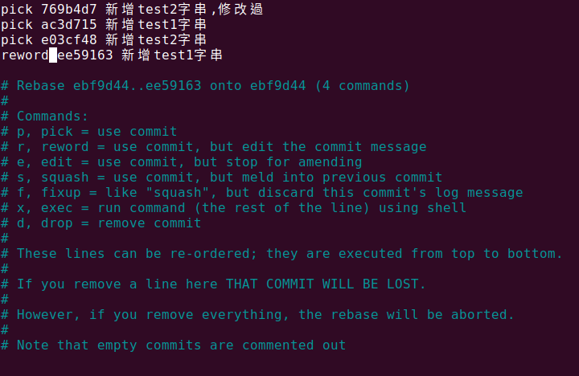

# 修改提交訊息(commit message)

## 1. 修改當前commit訊息

```Shell
$ git commit --amend -m "New commit message."
```

## 2. 修改歷史commit訊息

### (1). 先輸入git log看歷史紀錄

```Shell
jickey@jickey:~/git/test-branch$ git log 
commit 40e1f5ef8f1133f9c8989a134f16b8fbe231aadb (HEAD -> main, origin/main)
Merge: ebf9d44 afc8de4
Author: jickeyyeh <mail>
Date:   Thu Dec 15 14:21:55 2022 +0800

    Merge branch 'main' of github.com:jickeyyeh/test-branch into main

commit ebf9d4457184e06d98f597b3130269a4d7af694e
Author: jickeyyeh <mail>
Date:   Wed Dec 14 17:44:20 2022 +0800

    新增test1字串

commit af9cf1e531513013c5829731654c5202a3712148
Author: jickeyyeh <mail>
Date:   Wed Dec 14 17:38:50 2022 +0800

    新增test2字串

commit ffa98b5da4277b448c0c783bda86a56284081642
Author: jickeyyeh <mail>
Date:   Wed Dec 14 17:44:20 2022 +0800

    新增test1字串
```

可能如上列很多筆

### (2). 使用rebase修改歷史紀錄訊息

(2-1). 
指令如下

```Shell
git rebase -i HEAD~n
```

(2-2). 
n為要修改的行數, 例如要把上列ffa98b 的commit message修改
就要輸入如下

```Shell
git rebase -i HEAD~4
```

執行結果如下列圖示:


(2-3). 
將要修改的commit message前方的pick , 
更改為reword, 按下Ctrl + x , 再按下y, 最後按下Enter儲存後離開

執行結果如下列圖示:



(2-4).
儲存離開後, 會進入之前將pick修改為reword的歷史紀錄訊息

如下圖:


將內容修改為你要更改的訊息, 
然後按下Ctrl + x , 再按下y, 最後按下enter儲存後離開

如下圖:


離開後會獲得類似下列訊息

```Shell
jickey@jickey:~/git/test-branch$ git rebase -i HEAD~4
[detached HEAD d5e0646] 新增test1字串, 此為修改reword的歷史紀錄訊息
 Date: Wed Dec 14 17:44:20 2022 +0800
 1 file changed, 1 insertion(+), 1 deletion(-)
Successfully rebased and updated refs/heads/main.
```

(2-5).
將修改後的歷史紀錄訊息, 上傳至github

```Shell
git push -f
```


---
[回目錄](README.md)

